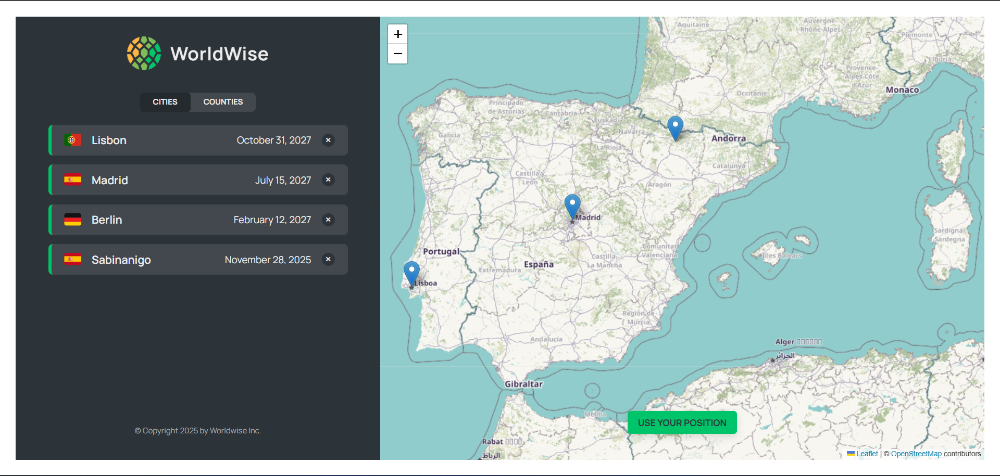

# 🌍 WorldWise

WorldWise is a React application that helps users track cities and countries they’ve visited.  
The project focuses on modern React architecture, routing, and global state management.

---

## 🚀 Key Features

- Track visited cities and countries
- Client-side routing with React Router
- Authentication flow (mocked)
- Global state using Context API + useReducer
- Custom hooks for reusable logic
- Lazy loading with React Suspense
- Modular and scalable component structure

---

## 🛠️ Tech Stack

- React
- React Router
- Context API
- useReducer
- Custom Hooks
- CSS Modules
- Vite

---

## 📸 Screenshot



---

## ⚙️ Installation & Setup

```bash

git clone https://github.com/your-username/worldwise.git
cd worldwise
npm install
npm run dev


🎯 What This Project Demonstrates

Strong understanding of React fundamentals
Real-world state and data flow patterns
Clean component-driven architecture
Readiness for building scalable frontend applications

👋 About

WorldWise represents a key step in my journey toward building real-world, production-ready React applications by focusing on core concepts and architecture.
```
